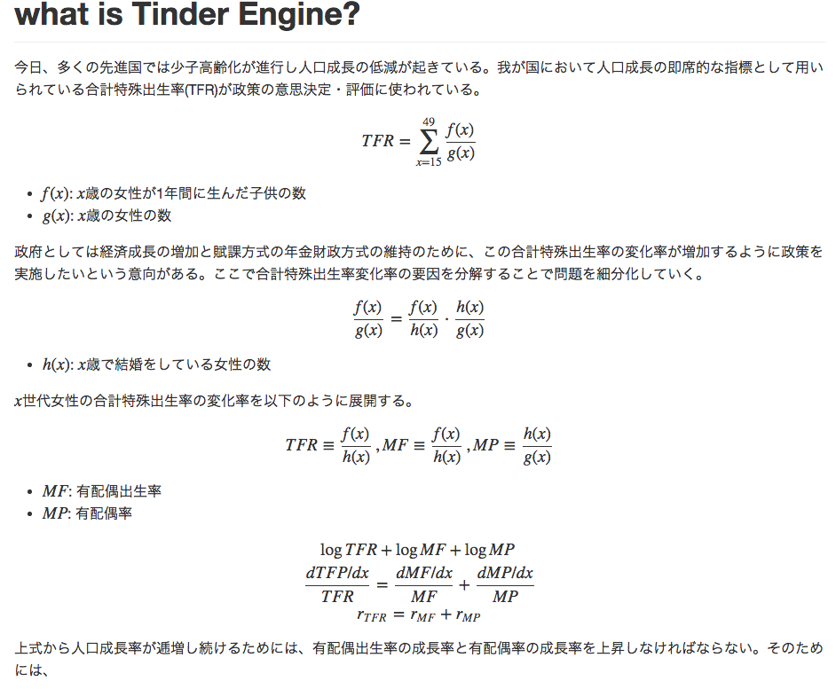

# Tinder Engine

tinder_engineモジュールの構成
```
tinder_engine
 |
 |----analytics: 分析用のフォルダ
 |
 |----dumps: データの出力先フォルダ
 |
 |----modules
 |       |
 |       |--__init__.py
 |       |--fb_auth_token.py
 |       |--features.py
 |       |--README.md
 |       |--tinder_api.py
 |
 |--like_bot.py
 |--README.md
 |--requirements.txt
```

## How to use?
### 1. 必要なパッケージをインストール

```
pip install -r requirements.txt
```

### 2. `modules`フォルダに`config.py`を作成する
新規作成する`config.py`ファイルは以下のコードである

```python
from modules import fb_auth_token

fb_username = """Your facebook email"""
fb_password = """Your facebook password"""
fb_access_token = fb_auth_token.get_fb_access_token(fb_username, fb_password)
fb_user_id = fb_auth_token.get_fb_id(fb_access_token)
host = 'https://api.gotinder.com'
```

### 3. スクリプトを実行する
`python like_bot.py`で自動LikeとLikeしたユーザをjsonで保存


---

