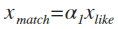
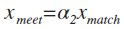
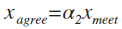

# what is Matching Engine?

本パッケージでは、**マッチング系サービスにおける男性ユーザの女性と会う確率(以後、面会率と呼称)を最大にする**ためのアプリケーションとなるものである。マッチングサービスは所与の時間・選好・可処分所得のもとで人脈ネットワークを拡大するためのサービスであり、そのネットワークは①ビジネス型②余暇型の二つがあると考えられる。前者のビジネス型人脈ネットワークは、相互に接続する主体が所得・利潤の最大化を実現するためのネットワークであり、後者の余暇型人脈ネットワークは余暇に自分の効用を最大化するためのネットワークであり、友達/恋人ネットワークがこれに該当する。つまり、TinderやPairsなどは余暇型の人脈ネットワークを拡大するためのサービスである。

Matching Engineは、より効率的に女性と会えるようにするアプリである。そして、効率性とは以下の3つの指標を指すものとする。

> ### 第1段階 : マッチング率

> 

>
> - X_like : 他のユーザに送信されたつながり要求数
> - X_match : 相互に承認された数
> - a_1 : マッチング率
>
> マッチングサービス上で、ユーザ同士が相互につながりのある関係になる確率。これは、一方のユーザが他ユーザに向けて相互つながりをもつことを要求し、その要求が承認されるか否かの指標である。
>

 

> ### 第2段階 : 面会率

> 

>
> - X_meet : 面会人数(実際に会った人数)
> - a_2 : 面会率
>
> マッチングサービスで、相互につながりのある関係にあるユーザと実際に会う確率。

 

> ### 第3段階 : 契約率

> 

>
> - X_agree : 合意形成に至った人数
> - a_3 : 契約率
> 実際に会った人のうちどれだけの人がなんらかの合意形成に達したかの確率。マッチングサービスの男性ユーザの場合、会った女性のうちどれだけの女性が彼女になったかの確率となる。